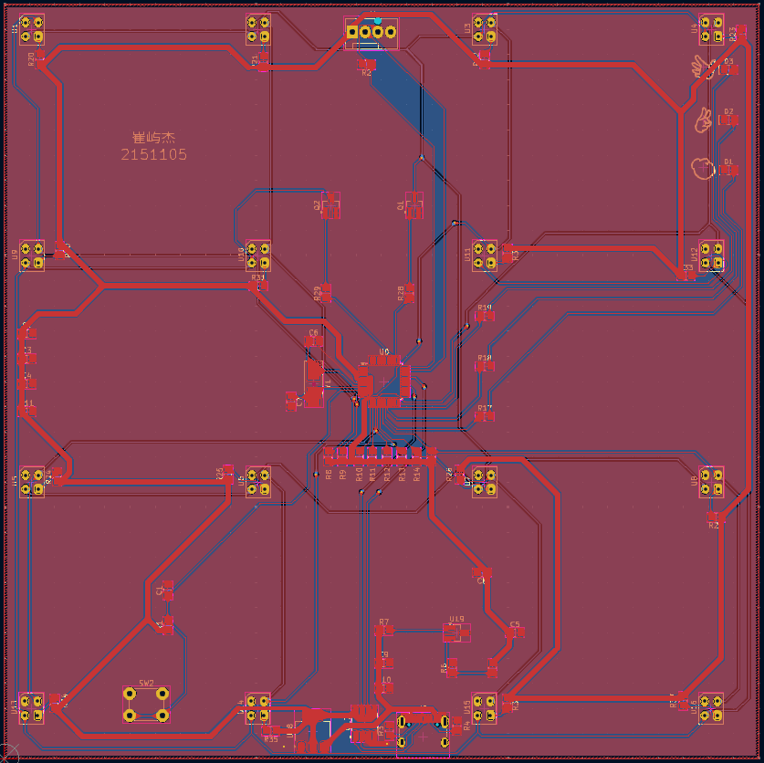

# Infrared-based-Gesture-Recognition
Infrared-based Gesture Recognition

This repositories introduces "Comprehensive Design and Practice A Comprehensive Experiment (IV)" focusing on the design of a gesture recognizer based on STM32G0 and infrared reflection sensors. Starting with the design requirements for gesture recognition, it elaborates on the implementation process from two main aspects: hardware circuitry and software programming, ultimately presenting the achieved results.

# Schematic Diagram

# Flowchart

# PCB

# Demo
[Demo](Demo.mp4)